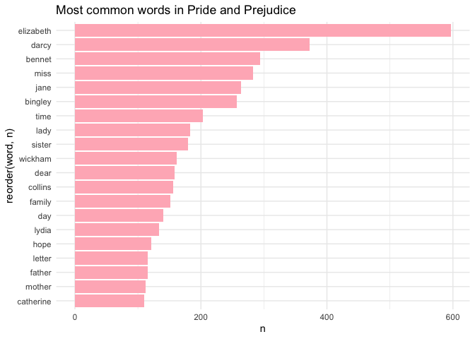

Assignment b4
================
Jasleen Kaur
2023-12-07

Load the required packages

``` r
library(janeaustenr)
library(stringr)
library(tidyverse)
library(ggplot2)
library(tidytext)
library(stopwords)
```

# Exercise 1

First, we convert the text into a dataframe

``` r
pride_df <- tibble(text = prideprejudice)
```

Split the text into words and remove stop words

``` r
pride_freq <- pride_df %>%
  unnest_tokens(word, text) %>%
  anti_join(stop_words)
```

Count the frequency of each word

``` r
word_counts <- pride_freq %>%
  count(word, sort = TRUE)
```

Plotting the top 20 words

``` r
word_counts %>%
  slice_max(n = 20, order_by = n) %>%
  ggplot(aes(x = reorder(word, n), y = n)) +
  geom_col(fill = "lightpink") +
  coord_flip() +
  theme_minimal() +
  labs(xlab = " ", ylab = "Frequency", title = "Most common words in Pride and Prejudice")
```

<!-- --> \#
Exercise 2

``` r
#' Convert words to custom Pig Latin
#'
#' This function takes a word as input and converts it to a custom version of Pig Latin.
#' The conversion involves rearranging the letters and adding a custom suffix.
#'
#' @param word A character string representing the word to be converted.
#' @param suffix A custom suffix to be added to the rearranged word.
#'
#' @return A character string representing the word in custom Pig Latin.
#'
#' @examples
#' pig_latin_converter("hello", "-way")
#' # Returns: "ello-hway"
#'
#' pig_latin_converter("apple", "-xyz")
#' # Returns: "pple-xyz"
#'
#' pig_latin_converter("school", "-123")
#' # Returns: "ools-ch123"
#'
#' @export
pig_latin_converter <- function(word, suffix) {
  # Check if the input is a character string
  if (!is.character(word) || length(word) != 1) {
    stop("Input must be a single character string.")
  }

  # Check if the suffix is a character string
  if (!is.character(suffix) || length(suffix) != 1) {
    stop("Suffix must be a single character string.")
  }

  # Convert the word to lowercase for consistent handling
  word <- str_to_lower(word)

  # Rearrange the letters based on the custom Pig Latin rules
  if (str_sub(word, 1, 1) %in% c("a", "e", "i", "o", "u")) {
    # For words starting with vowels, move the first consonant or cluster to the end
    rearranged_word <- paste0(str_sub(word, 2, nchar(word)), str_sub(word, 1, 1))
  } else {
    # For words starting with consonants, move all letters before the initial vowel to the end
    vowel_position <- str_locate("[aeiou]", word)
    rearranged_word <- paste0(str_sub(word, vowel_position, nchar(word)), str_sub(word, 1, vowel_position - 1))
  }

  # Add the custom suffix to the rearranged word
  pig_latin_word <- paste0(rearranged_word, suffix)

  return(pig_latin_word)
}

# Examples
print(pig_latin_converter("hello", "-way"))
```

    ## [1] "NANA-way" "NANA-way"

``` r
# Returns: "ello-hway"

print(pig_latin_converter("apple", "-xyz"))
```

    ## [1] "pplea-xyz"

``` r
# Returns: "pple-xyz"

print(pig_latin_converter("school", "-123"))
```

    ## [1] "NANA-123" "NANA-123"

``` r
# Returns: "ools-ch123"
```
